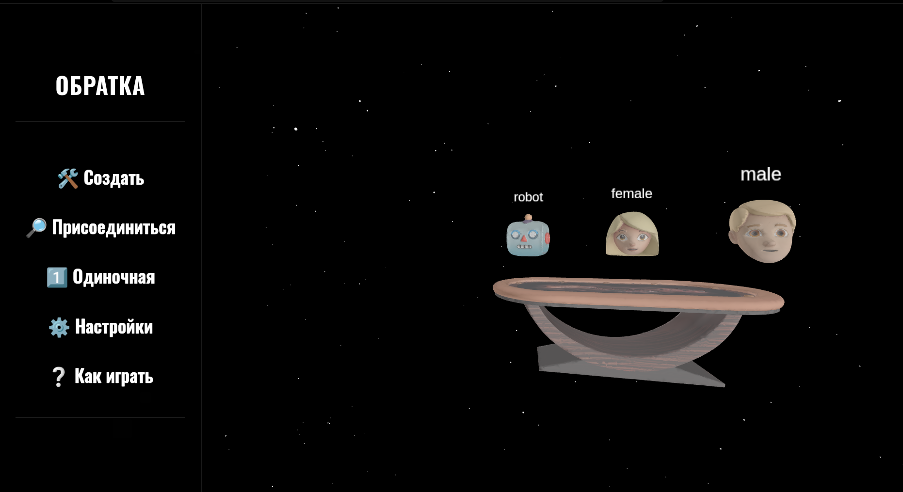
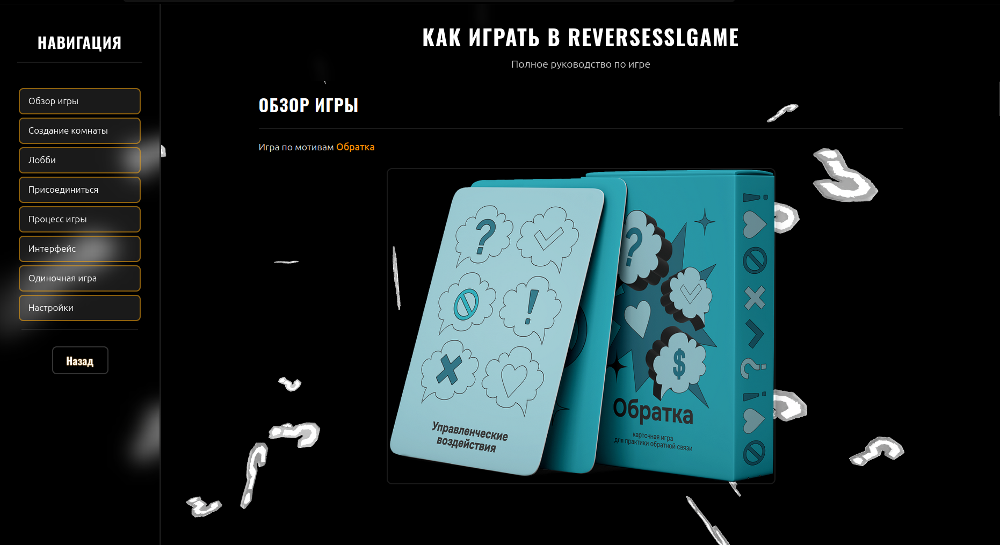
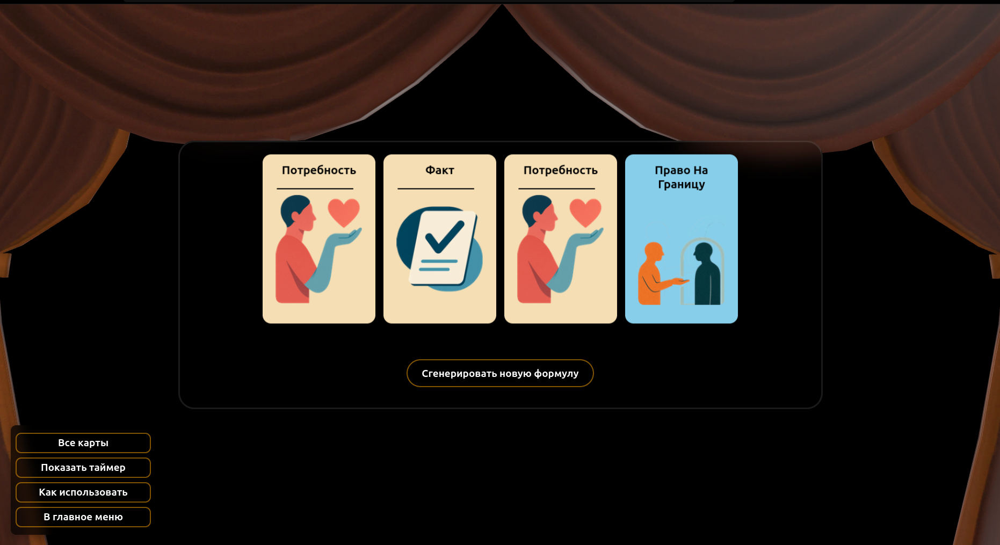
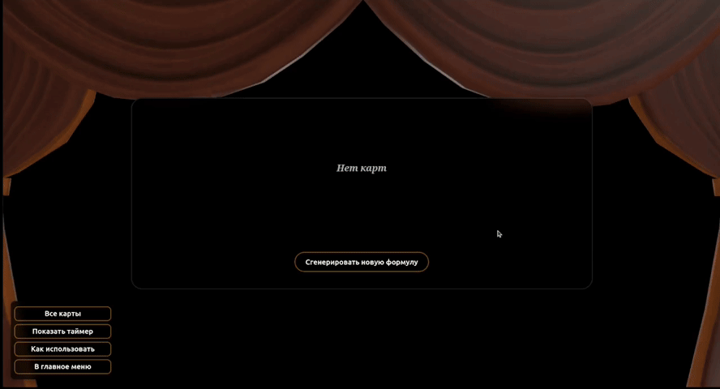
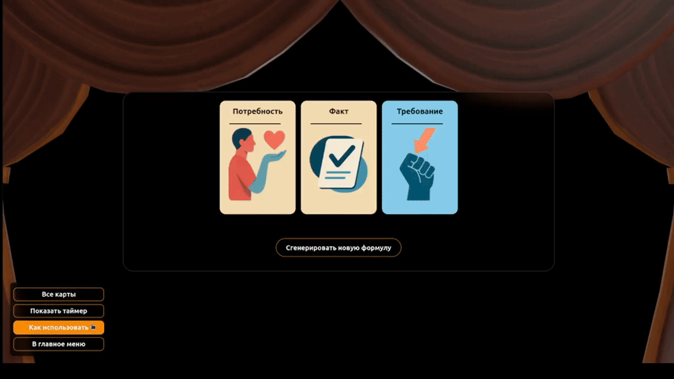
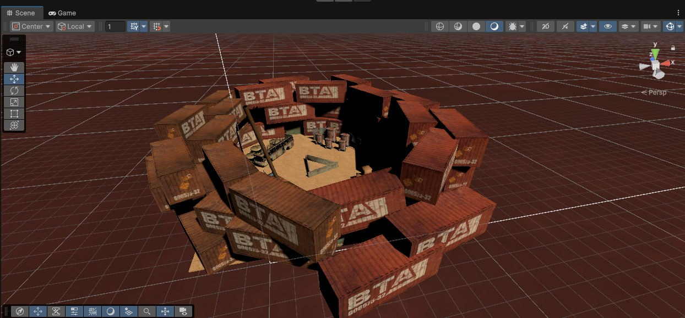
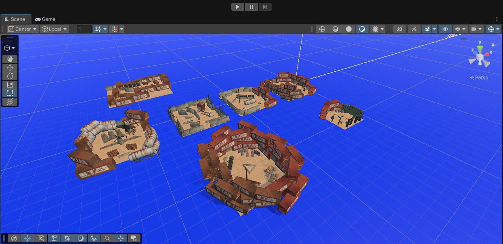
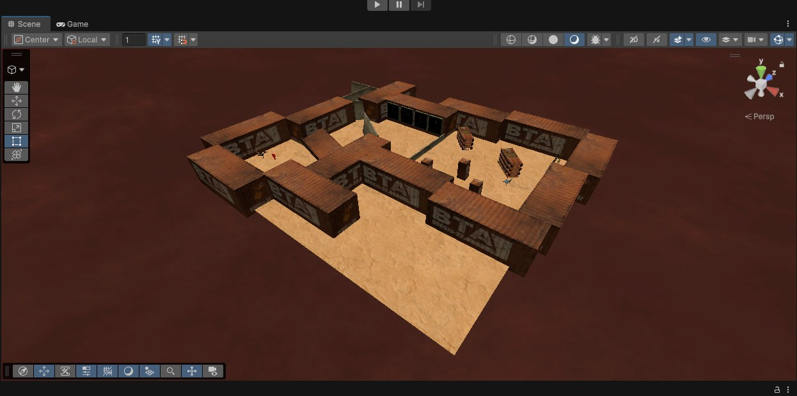

# Projects

This page contains all projects with breaf description and showcase of functionality

- List
    - [Debate Timer](#Debate-Timer)
    - [Feedback Game]()
    - [Roguelike game](#Roguelike-Game)
    - [Conflict generator LLM]()
    - [Audio Installation]()

---

# Debate Timer

### Links

|  |  |
| --- | --- |
| [Repository](https://github.com/qFioofa/NegotiationTimer) | [Site showcase](https://negotiationtimer.up.railway.app/) |

## Stack

## Description

## Gallary

### Animations

---

# Feedback Game

### Links

|  |  |
| --- | --- |
| Repository (Private) | [Site showcase](https://reversesslgame-production.up.railway.app/) |

## Stack

## Description

## Links

## Gallary

---

---

# Roguelike Game

### Links
|  |  |
| --- | --- |
| [Repository](https://github.com/qFioofa/RoguelikeGame) | [App ready to play](https://github.com/qFioofa/RoguelikeGame/releases/tag/Build) |

## Stack

## Description

## Gallary

# Conflict generator LLM

## Description

## Gallary

# Audio Installation

### Links

## Stack

## Description

## Gallary

---
