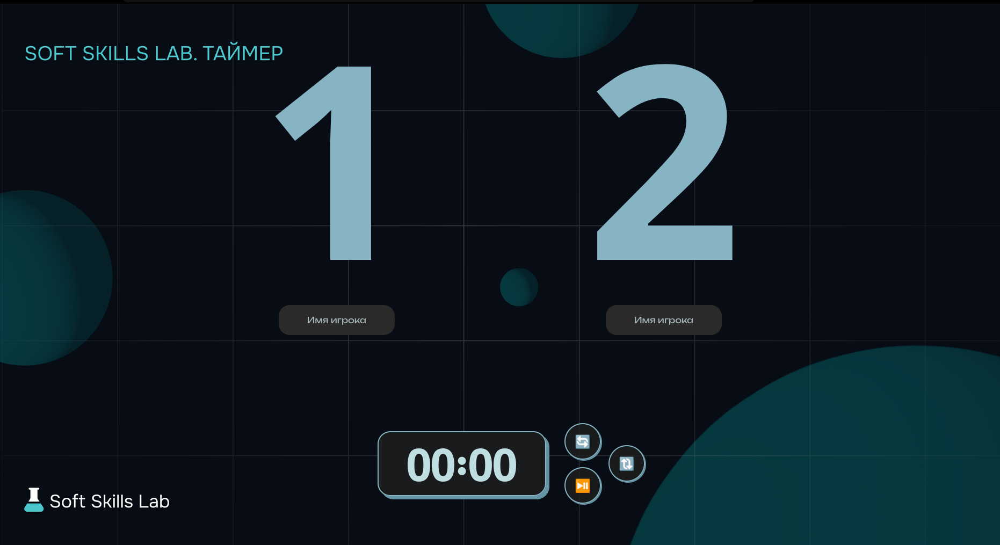
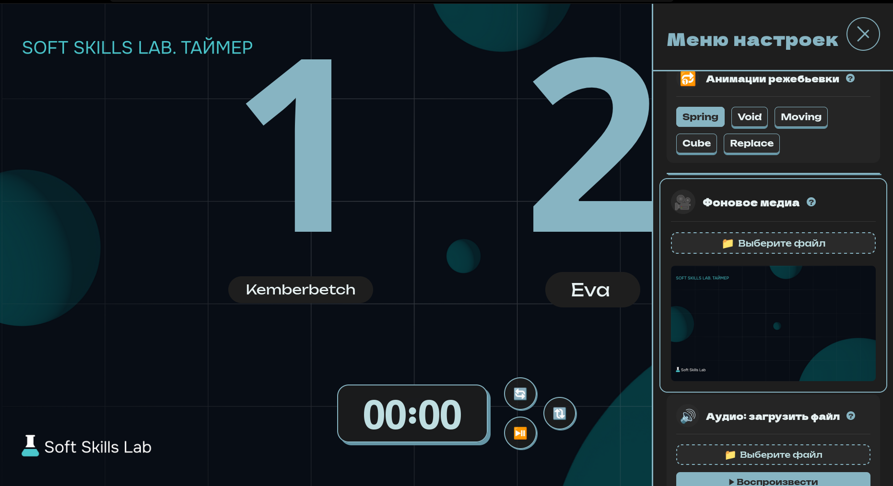
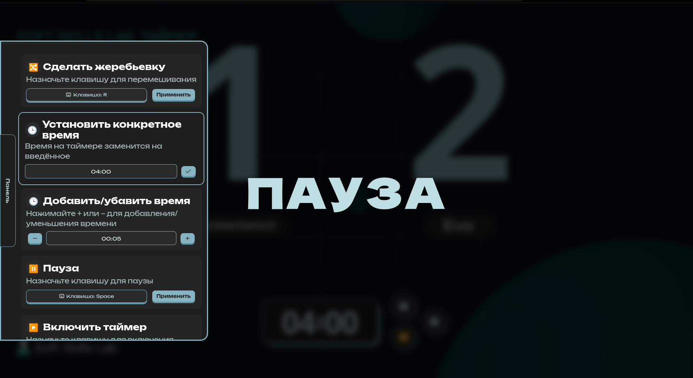

# Projects

This page contains all projects with breaf description and showcase of functionality

- List
    - [Debate Timer](#Negotiation-Timer)
    - [Feedback Game]()
    - [Roguelike game]()
    - [Conflict generator LLM]()
    - [Audio Installation]()

---

# Debate Timer

### Links

<table>
    <tr>
        <td>
            
        </td>
        <td>
            
        </td>
    </tr>
    <tr>
        <td>
            <a href="https://github.com/qFioofa/NegotiationTimer">Repository</a>
        </td>
        <td>
            <a href="https://negotiationtimer.up.railway.app/">Site showcase</a>
        </td>
    </tr>
</table>

## Stack

    

    

## Description

## Gallary

<table style="width: 100%; border-collapse: collapse;">
  <tr>
    <td style="width: 50%;"></td>
    <td style="width: 50%;">
      
    </td>
  </tr>
  <tr>
    <td>
      
    </td>
    <td>
      
    </td>
  </tr>
</table>

---

# Feedback Game

### Links

<table>
    <tr>
        <td>
            <a>Repository (Private)</a>
        </td>
        <td>
            <a href="https://reversesslgame-production.up.railway.app">Site showcase</a>
        </td>
    </tr>
</table>

## Stack

    

    

## Description

## Links

## Gallary

# Roguelike Game

### Links

## Stack

    

    

## Description

## Gallary

# Conflict generator LLM

    

    

## Description

## Gallary

# Audio Installation

### Links

## Stack

    

## Description

## Gallary

---
