# Проекты

Здесь собраны все проекты с кратким описанием и демонстрацией функционала.

- Список
    - [🧰 Навыки](#навыки)
    - [⏱️ Debate Timer](#debate-timer)
    - [🤖 Conflict Generator LLM](#conflict-generator-llm)
    - [🎮 Feedback Game](#feedback-game)
    - [🎮 Roguelike Game](#roguelike-game)
    - [📱 Android Apps](#android-apps)
    - [♿ Web Accessibility](#web-accessibility)
    - [🎶 Audio Installation](#audio-installation)
    - [🛠️ Development Environment](#development-environment)

---

# Навыки

Сводка по всем проектам и задачам — что реально применял на практике.

- **Языки:** Python, Java, Kotlin, Go, JS/TS, C#, Zig, Lua, Bash, SQL
- **Базы данных:** проектирование реляционных схем, транзакции и уровни изоляции, хранимые процедуры, индексы и оптимизация запросов, хранилища данных и OLAP
- **Данные / ML:** Pandas, сбор и ручная разметка датасетов, дообучение LLM
- **Backend / боты:** Telegram Bot API, REST-интеграции, раздача ML-модели через бота
- **Конкурентность:** горутины, каналы, синхронизация (Go)
- **DevOps / инфра:** Docker (Compose), NixOS, Linux-сети (TCP/IP, адресация, маршрутизация)
- **Frontend:** Svelte, three.js, веб-доступность (a11y)
- **Open-source:** Neovim-плагин, tree-sitter грамматика, ASCII-фреймворк на Zig
- **Прочее:** командная разработка, Git, Gradle, воспроизводимое окружение

[⬅️ Наверх к списку](#проекты)

---

# Debate Timer

Таймер для клуба переговоров: полностью брендируемый экран отсчёта, который готовится к мероприятию за 3 клика.

### Ссылки
|  |  |
| --- | --- |
| [Репозиторий](https://github.com/qFioofa/NegotiationTimer) | [Демо сайта](https://negotiationtimer.up.railway.app/) |

## Стек

## Возможности

- Гибкая кастомизация под бренд и атмосферу мероприятия
    - Смена фона, темы и звука — вплоть до видео на фоне
    - Автопауза при открытии меню, управление с клавиатуры
- Настройки сохраняются и переносятся одним файлом
    - Подготовка к мероприятию — 3 клика вместо ручной настройки

## Галерея

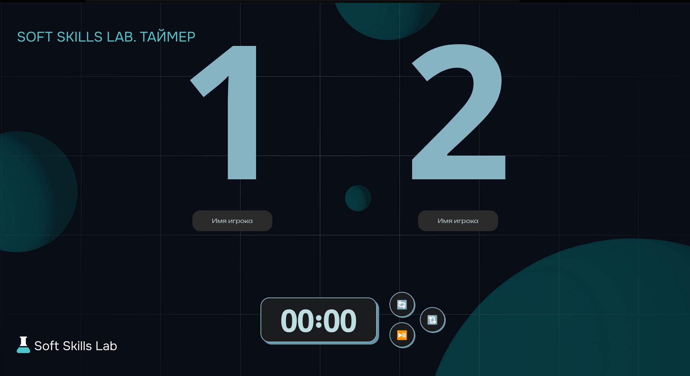
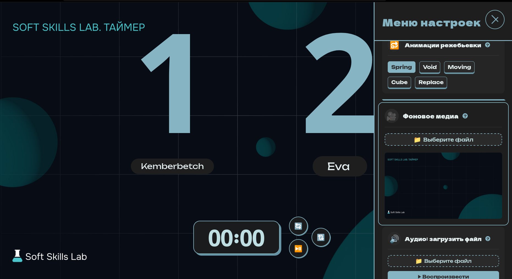
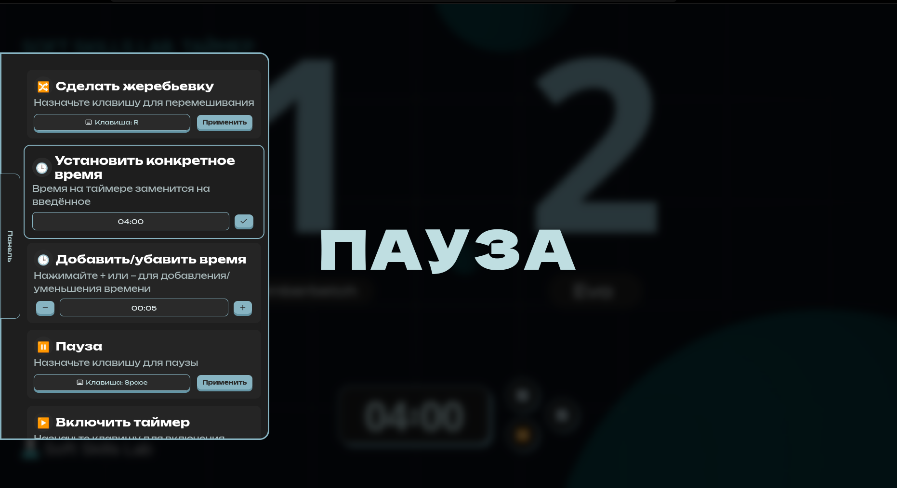

### Анимации

## Результаты

- Работает в продакшене и используется на реальных встречах клуба переговоров <!-- TODO: впиши число мероприятий/людей, напр. «на N встречах» -->
- Развёрнут через Docker на Railway с публичным доступом
- Освоил Svelte с нуля до рабочего продакшен-приложения
- Функционал развивается по запросам пользователей

[⬅️ Наверх к списку](#проекты)

---

# Conflict Generator LLM

Дообученная LLM, которая генерирует конфликтные ситуации для тренировки переговоров, плюс полный пайплайн: свой датасет → дообучение → Telegram-бот.

### Ссылки

|  |  |
| --- | --- |
| [Telegram-бот дообученной модели](https://github.com/qFioofa/TuningModelTGBotShowcase) | [Датасет конфликтных ситуаций](https://huggingface.co/datasets/BroneBonBon/conflict-situations-test) |

|  |  |
| --- | --- |
| [Лендинг генератора](https://github.com/qFioofa/ConflictGeneratorLanding) | [Инструменты создания датасета](https://github.com/qFioofa/ConflictDatasetCreation) |

|  |
| --- |
| [Дообучение модели](https://colab.research.google.com/drive/1z09DdHNGDC8iIQOlYuxSUwF0pIjjvE0l?usp=drive_link) |

## Стек

## Возможности

- Пошаговый гайд по дообучению LLM под узкую задачу на базе готовых моделей
- Датасет ~500 записей, собран с нуля и проверен вручную
    - Выделены ключевые признаки, выполнена фильтрация данных
- Telegram-бот как продуктовая обёртка над моделью
    - Модульная архитектура: хендлеры, ядро, шаблоны, параметры
    - Контейнеризация через Docker Compose

## Результаты

- Дообученная модель генерирует конфликтные ситуации <!-- TODO: впиши метрику модели, напр. качество/accuracy или размер выборки для оценки -->
- Собран и опубликован датасет на Hugging Face (~500 записей)
- Полный пайплайн от сбора данных до задеплоенного Telegram-бота
- Применяется в учёбе: клуб переговоров

[⬅️ Наверх к списку](#проекты)

---

# Feedback Game

3D-игра для тренировки навыка обратной связи — цифровая версия карточной игры «Обратка».

### Ссылки
|  |  |
| --- | --- |
| Репозиторий (приватный) | [Демо сайта](https://reversesslgame-production.up.railway.app/) |

## Стек

## Возможности

- 3D-визуализация на three.js — вау-эффект, который удерживает пользователя
- Система уведомлений
- Встроенный мануал по реальной [карточной игре «Обратка»](https://skillslab.center/boardgame)

## Галерея

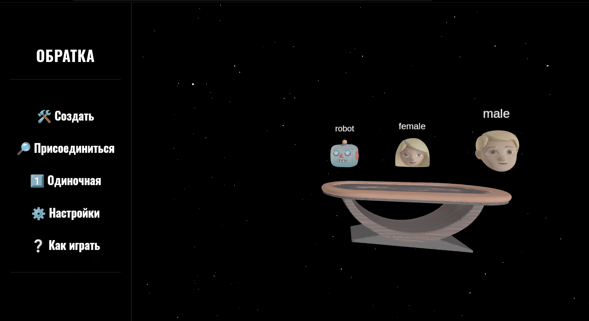

---

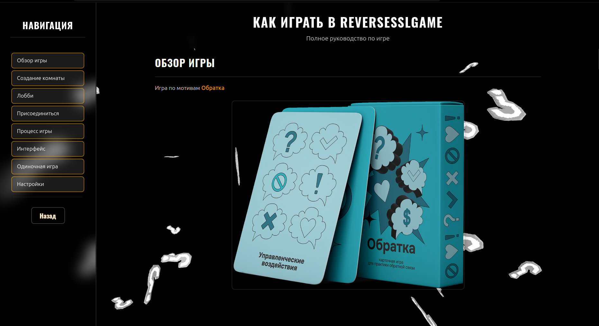

---

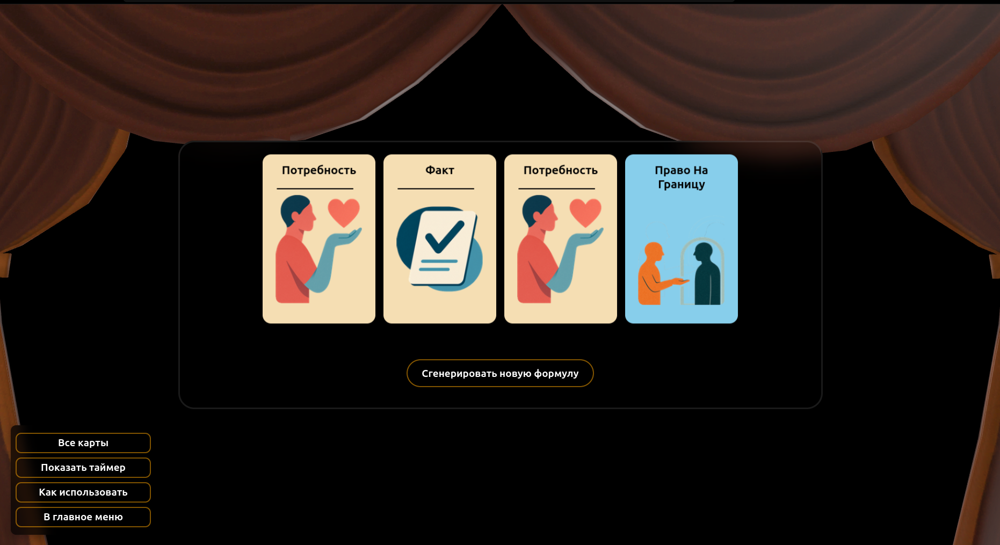
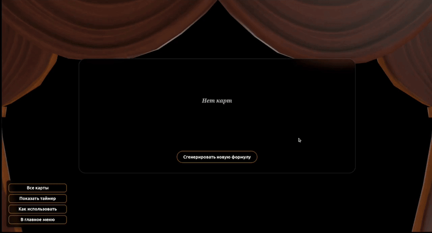
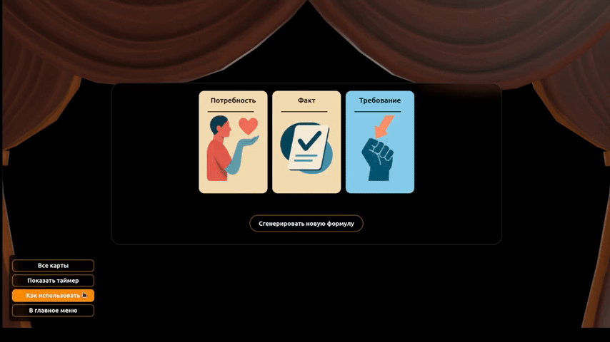

## Результаты

- Генератор формул для дачи обратной связи
- Переиспользуемый шаблон мультиплеера
- Готовая среда для тренировки обратной связи

[⬅️ Наверх к списку](#проекты)

---

# Roguelike Game

Рогалик на Unity с процедурной генерацией уровней, прокачкой и сохранениями.

### Ссылки

|  |  |
| --- | --- |
| [Репозиторий](https://github.com/qFioofa/RoguelikeGame) | [Готовое приложение](https://github.com/qFioofa/RoguelikeGame/releases/tag/Build) |

## Стек

## Возможности

- Процедурная генерация уровней
- Прокачка персонажа и сохранение прогресса
- ИИ противников
- Туториал и подсказки для комфортного входа в игру

## Галерея

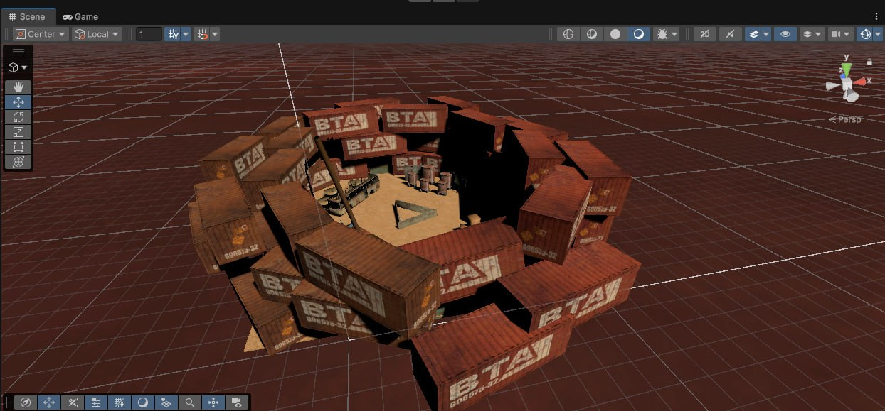
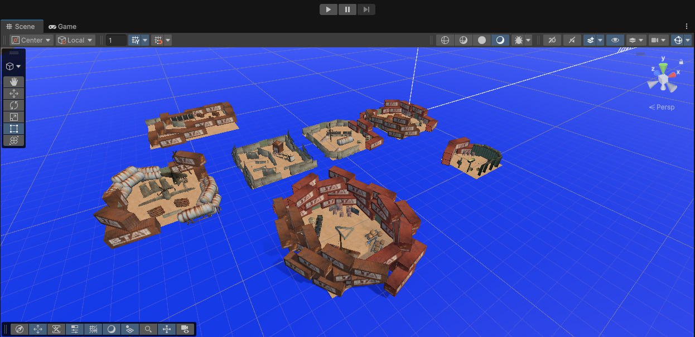
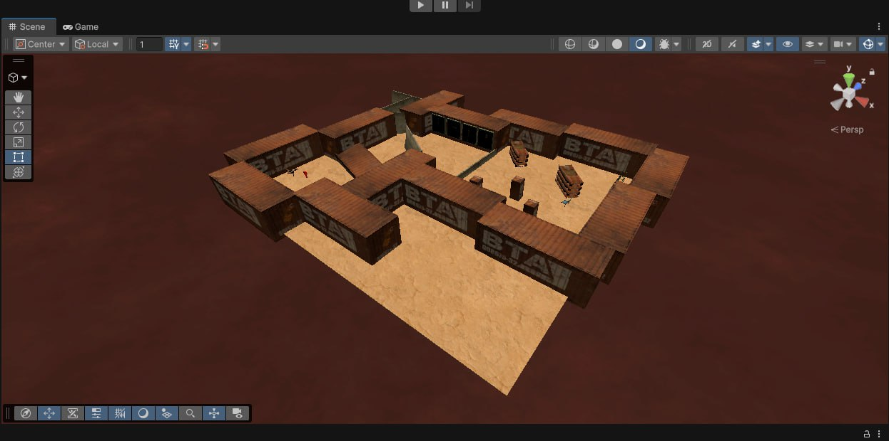

## Результаты

- Собранный playable-билд, доступный для скачивания
- Рабочий ИИ противников и импорт 3D-моделей
- Настройки, туториал и подсказки повышают удобство игры

[⬅️ Наверх к списку](#проекты)

---

# Android Apps

Мобильная разработка под Android: от новостного клиента с REST API до консольных и командных проектов на Java.

### Ссылки

|  |
| --- |
| [News App (Kotlin)](https://github.com/qFioofa/news-android-app) |

## Стек

## Возможности

- Новостной клиент на Kotlin с интеграцией NewsAPI
    - Управление ключами и лимитами API через `local.properties`
- Сборка через Gradle
- Понимание Java: OOP, процедурный и функциональный подходы

## Результаты

- Рабочее Android-приложение с интеграцией внешнего REST API
- Общее владение экосистемой Kotlin / Java / Gradle
- Командная разработка на Java (консольный roguelike с JCurses)

[⬅️ Наверх к списку](#проекты)

---

# Web Accessibility

Аудит и исправление веб-доступности: анализ сайта на нарушения a11y с задокументированными находками и задеплоенным результатом.

### Ссылки

|  |  |
| --- | --- |
| [Репозиторий](https://github.com/qFioofa/hackaton-2026.accessibility) | [Демо сайта](https://qfioofa.github.io/hackaton-2026.accessibility/root/) |

## Стек

## Возможности

- Аудит сайта на нарушения доступности (a11y)
- Задокументированный список найденных ошибок
- Исправленная версия, задеплоенная на GitHub Pages

## Результаты

- Хакатон-проект: понимание a11y как требования, а не опции
- Работа в команде под дедлайн с доведением до задеплоенного результата

[⬅️ Наверх к списку](#проекты)

---

# Audio Installation

Аудиовизуальная инсталляция на TouchDesigner: реактивный визуал в реальном времени с генерацией через LLM.

### Ссылки

|  |
| --- |
| [Репозиторий](https://github.com/Bambaleiio/Installation-Coursework) |

## Стек

## Возможности

- Два модуля `.tox` с плавным переключением между ними
    - Интеграция с разными LLM
- Динамический визуал
    - Адаптация под ввод пользователя, генерация в realtime

## Результаты

- Готовая инсталляция, показанная на мероприятии
- Два переиспользуемых модуля, которые легко встроить в другие проекты

[⬅️ Наверх к списку](#проекты)

---

# Development Environment

Полностью декларативное и воспроизводимое рабочее окружение на NixOS: один репозиторий разворачивает систему, тему и все инструменты с нуля. Не просто «настроил редактор», а инженерный подход к собственному тулингу.

## Стек

## Возможности

- Декларативная сборка всей системы через NixOS — воспроизводится одной командой
- Единая тема и раскладка клавиш во всех инструментах: Neovim, терминал, tmux, оболочка
- Кастомный терминал с шейдерами на GLSL, Wayland-композитор Niri
- Автоматизация рабочего процесса Bash-скриптами (tmux, Niri, сборка, установка тем)
- Собственные плагины и темы для Neovim, опубликованные отдельно

## Результаты

- Окружение поднимается на новой машине из одного репозитория без ручной настройки
- Написаны и выложены переиспользуемые инструменты:
    - [physical-keyboard.nvim](https://github.com/qFioofa/physical-keyboard.nvim) — vim-motions без переключения раскладки
    - [ascii-engine.zig](https://github.com/qFioofa/ascii-engine.zig) — фреймворк для ASCII-визуализаций на Zig без зависимостей
    - [tree-sitter-plantuml](https://github.com/qFioofa/tree-sitter-plantuml) — грамматика PlantUML для tree-sitter
- Собственные темы для Neovim (yugen-ash, hypno)

[⬅️ Наверх к списку](#проекты)

---
